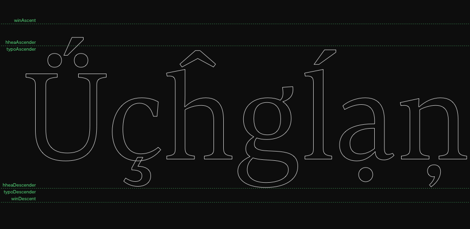

# ShowVerticalMetrics.glyphsReporter

This is a plugin for the [Glyphs font editor](http://glyphsapp.com/) by Georg Seifert. After installation, it will add the menu item *View > Show Vertical Metrics*. You can set a keyboard shortcut in System Preferences.

The plug-in will visualize the parameters `hheaAscender`, `hheaDescender`, `typoAscender`, `typoDescender`, `winAscent`, and `winDescent`, if present in *File > Font Info > Masters*.

Thanks to @tntype for the idea.

### Installation

1. One-click install *Show Vertical Metrics* from *Window > Plugin Manager*
2. Restart Glyphs.

or: 

1. Download the complete ZIP file and unpack it, or clone the repository.
2. Double click the .glyphsReporter file. Confirm the dialog that appears in Glyphs.
3. Restart Glyphs

### Usage Instructions

1. Open at least one glyph in Edit View.
2. Use *View > Show Vertical Metrics* to toggle the display of the Vertical Metrics.

### Requirements

The plugin needs Glyphs 2.4 or higher, running on OS X 10.9 or later. It does NOT work with Glyphs 1.x.

### License

Copyright 2015-2017 Rainer Erich Scheichelbauer (@mekkablue).
Based on sample code by Georg Seifert (@schriftgestalt).

Licensed under the Apache License, Version 2.0 (the "License");
you may not use this file except in compliance with the License.
You may obtain a copy of the License at

http://www.apache.org/licenses/LICENSE-2.0

See the License file included in this repository for further details.
